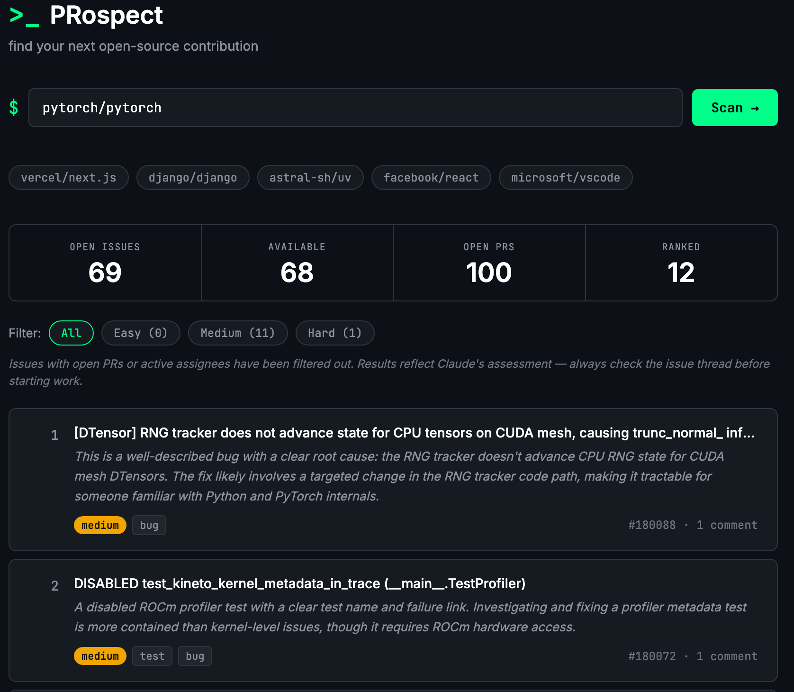

# PRospect

Find approachable open-source issues to contribute to. Paste any GitHub repo URL or slug — PRospect fetches open issues, filters out ones already being worked on, then asks Claude to rank the rest by how contributor-friendly they are.



## Setup

1. **Clone the repo**
   ```bash
   git clone https://github.com/Alexperiments/PRospect.git
   cd PRospect
   ```

2. **Install dependencies**
   ```bash
   npm install
   ```

3. **Deploy to Vercel**

   Import the repo at [vercel.com/new](https://vercel.com/new), then add the following environment variable in the Vercel dashboard:

   | Variable | Value |
   |---|---|
   | `ANTHROPIC_API_KEY` | Your Anthropic API key |

4. **Your app is live at**
   ```
   https://prospect.vercel.app
   ```

## Local development

```bash
npm install -g vercel
vercel dev
```

Open [http://localhost:3000](http://localhost:3000).

## How it works

1. User pastes a GitHub repo URL, slug, or SSH remote — the frontend normalizes it to `owner/repo`
2. The API fetches open issues, open PRs, README, and CONTRIBUTING.md in parallel from the GitHub API
3. Issues that have assignees or are referenced in any open PR's title/body are filtered out
4. The top 40 remaining issues (plus repo context) are sent to Claude to rank and label by difficulty
5. Results are returned as a ranked card list with Easy / Medium / Hard badges and tag labels
